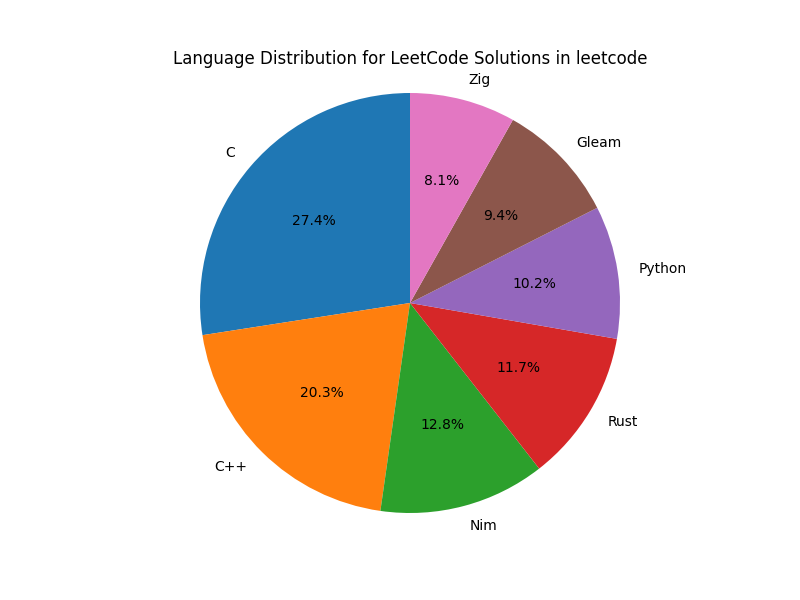

# Leetcode Solutions

This repository contains my solutions to Leetcode problems. I have solved these problems currently only in C, C++ and Python. I will be adding more solutions in other languages as well.

## Problems

| #   | Title                                                                                                                           | Solution                                                                                                                                                                                                                                                                                                                                                                                                                                                                                             | Difficulty |
| --- | ------------------------------------------------------------------------------------------------------------------------------- | ---------------------------------------------------------------------------------------------------------------------------------------------------------------------------------------------------------------------------------------------------------------------------------------------------------------------------------------------------------------------------------------------------------------------------------------------------------------------------------------------------- | :--------: | -------------------------------------------------------------------------------------------- |
| 1   | [Two Sum](https://leetcode.com/problems/two-sum/)                                                                               | [`C`](https://github.com/burakssen/leetcode/tree/C/1.%20Two%20Sum) [`C++`](https://github.com/burakssen/leetcode/tree/C++/1.%20Two%20Sum) [`Python`](https://github.com/burakssen/leetcode/tree/python/1.%20Two%20Sum) [`Rust`](https://github.com/burakssen/leetcode/tree/rust/src/problems) [`Zig`](https://github.com/burakssen/leetcode/tree/zig/src/1.%20Two%20Sum) [`Gleam`](https://github.com/burakssen/leetcode/tree/gleam/src) [`Nim`](https://github.com/burakssen/leetcode/tree/nim/src) |     🟩     |
| 2   | [Add Two Numbers](https://leetcode.com/problems/add-two-numbers/)                                                               | [`C`](https://github.com/burakssen/leetcode/tree/C/2.%20Add%20Two%20Numbers) [`C++`](https://github.com/burakssen/leetcode/tree/C++/2.%20Add%20Two%20Numbers) [`Python`](https://github.com/burakssen/leetcode/tree/python/2.%20Add%20Two%20Numbers) [`Rust`](https://github.com/burakssen/leetcode/tree/rust/src/problems) [`Gleam`](https://github.com/burakssen/leetcode/tree/gleam/src) [`Nim`](https://github.com/burakssen/leetcode/tree/nim/src)                                              |     🟨     |
| 3   | [Longest Substring Without Repeating Characters](https://leetcode.com/problems/longest-substring-without-repeating-characters/) | [`C`](https://github.com/burakssen/leetcode/tree/C/3.%20Longest%20Substring%20Without%20Repeating%20Characters) [`C++`](https://github.com/burakssen/leetcode/tree/C++/3.%20Longest%20Substring%20Without%20Repeating%20Characters)                                                                                                                                                                                                                                                                  |     🟨     |
| 4   | [Median of Two Sorted Arrays](https://leetcode.com/problems/median-of-two-sorted-arrays/)                                       |                                                                                                                                                                                                                                                                                                                                                                                                                                                                                                      |     🟥     | [`C`](https://github.com/burakssen/leetcode/tree/C/4.%20Median%20of%20Two%20Sorted%20Arrays) |

# Current Language Usage Distribution

| Language | Problems Solved |
| -------- | --------------- |
| C        | 4               |
| C++      | 3               |
| Python   | 2               |
| Rust     | 2               |
| Zig      | 1               |
| Gleam    | 2               |
| Nim      | 2               |

